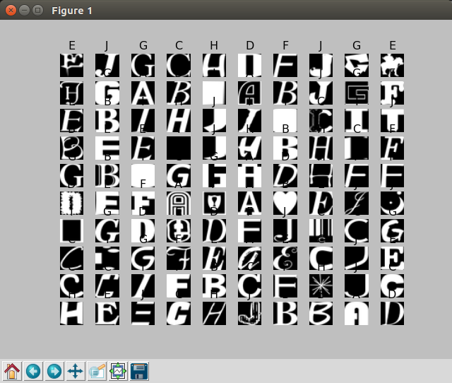
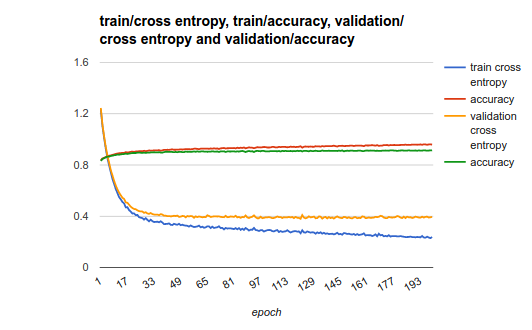
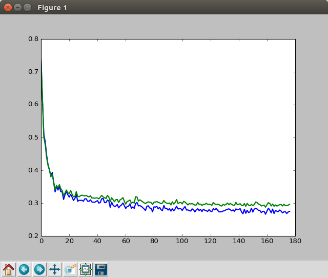
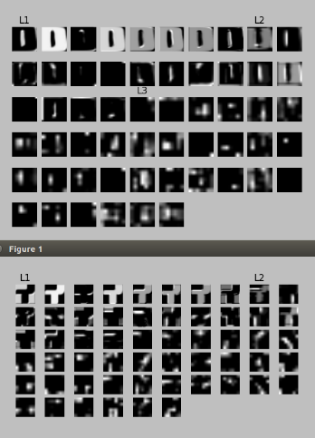

# Deep Learning Udacity
* Self-study of [Udacity Deep Learning](https://www.udacity.com/course/deep-learning--ud730)
 
# Folder structure
* `udacity_notebook`: Udacity homework, which is copied from [https://github.com/tensorflow/tensorflow/tree/master/tensorflow/examples/udacity](https://github.com/tensorflow/tensorflow/tree/master/tensorflow/examples/udacity)
* `tensorflow_examples`: Extract essential from the homework.

# Tensorflow Examples
## `MLP_notMNIST`


* With the configuration
```
learning_params = {
    'n_layer1': 1024,
    'n_layer2': 512,
    'n_layer3': 256,
    'batch_size': 300,
    'dropout_probability': 0.7,
    'training_epochs': 1000,
    'max_test_time': 60*60*5,
    'starter_learning_rate': 0.1,
    'beta_regularization_value': 0.001
}
```

* The Cross entropy is saturated at ~50 epoch



* Results
```
# epoch complete: step 133199 num_training 39960000 time:5:00:04.257040
# epoch complete: Train [CrossEntropy / Training Accuracy] 0.2387 / 0.9590
# Validation [CrossEntropy / Training Accuracy] 0.3955 / 0.9148
# BREAK: TIME OVER
# Complete training. Total time:5:00:13.045505
# Testing [CrossEntropy / Training Accuracy] 0.2168 / 0.9653
```

## `CONV_notMNIST`
* With the configuration
 * Similar to [LeNet5](http://culurciello.github.io/tech/2016/06/04/nets.html)
```
learning_params = {
    'patch_size': 3,
    'depth_1': 8,
    'depth_2': 16,
    'depth_3': 32,
    'hidden_n_output_1': 256,
    'hidden_n_output_2': 128,
    'batch_size': 128,
    'dropout_probability': 0.7,
    'training_epochs': 10000,
    'max_test_time': 60 * 60 * 9,
    'starter_learning_rate': 0.1,
    'beta_regularization_value': 0.001
}
```

* Test accuracy: 96.98%
 * With a CNN layout with following configurations, which is similar to [LeNet5](http://culurciello.github.io/tech/2016/06/04/nets.html)
 * However there is little difference
```
convolutional (3x3x8)
max pooling (2x2)
dropout (0.7)
relu

convolutional (3x3x16)
max pooling (2x2)
dropout (0.7)
relu

convolutional (3x3x32)
avg pooling (2x2): according to above article
dropout (0.7)
relu

fully-connected layer (265 features)
relu
dropout (0.7)

fully-connected layer (128 features)
relu
dropout (0.7)

softmax (10)

decaying learning rate starting at 0.1
batch_size: 128

Training accuracy: 93.4%
Validation accuracy: 92.8%
```

* The Cross entropy is saturated at ~100 epoch




* Results
```
epoch complete: step 276473 num_training 35388672 time:9:01:38.853269
epoch complete: Train [CrossEntropy / Training Accuracy] 0.2745 / 0.9331
Validation [CrossEntropy / Training Accuracy] 0.2966 / 0.9262
BREAK: TIME OVER
Complete training. Total time:9:01:57.943160
Testing [CrossEntropy / Training Accuracy] 0.1643 / 0.9698
```

## `word2vec`
* Use skip gram algorithm
 * check [CS224d: Deep Learning for Natural Language Processing](http://cs224d.stanford.edu/lecture_notes/notes1.pdf)
 * The implementation uses [sampled softmax](https://github.com/tensorflow/tensorflow/blob/master/tensorflow/python/ops/nn.py#L1127), rather than Negative Sampling, which Mikolov used in his paper.
 * In my opinion, sampled softmax is more intuitive than Mikolov's Negative Sampling, which is weird sigmoid approximation.
 * The basic idea for both approximation is same. Choose small number of negative samples.
* TODO: implement [GloVe](http://nlp.stanford.edu/pubs/glove.pdf)

* Results
```
Average loss at step 96000: 3.738376
Average loss at step 98000: 3.848188
Average loss at step 100000: 3.819818
Nearest to often: usually, sometimes, generally, many, commonly, now, these, typically,
Nearest to some: many, these, other, several, those, different, all, are,
Nearest to were: are, was, have, had, be, been, several, many,
Nearest to used: considered, referred, known, use, steinberg, found, available, frequent,
Nearest to to: in, would, for, and, will, can, it, may,
Nearest to see: e, known, called, external, list, tragedies, may, will,
Nearest to years: year, time, centuries, bc, months, hours, shearer, schedules,
Nearest to for: of, to, and, in, with, but, on, as,
Nearest to world: war, presentations, hellboy, astrodome, befell, ally, lepidus, mid,
Nearest to between: over, about, minoan, on, with, neq, howlin, algirdas,
Nearest to d: b, c, f, l, t, r, e, n,
Nearest to been: become, were, be, was, suggested, come, has, have,
Nearest to state: city, general, teaches, government, encrypted, university, hellas, slocum,
Nearest to no: there, any, not, this, a, pipelined, dingo, little,
Nearest to UNK: one, two, and, isbn, seven, eight, five, by,
Nearest to people: those, who, them, some, jewish, groups, american, books,
```

* 2D TSNE (t-distributed Stochastic Neighbor Embedding) for 400 frequent words
